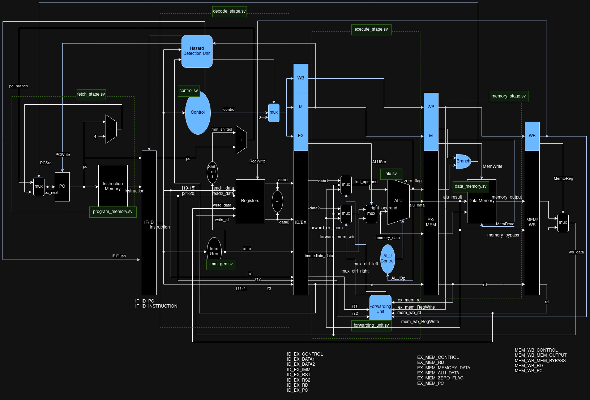

# RISC-V on FPGA

32-bit 5-stage RISC-V processor for FPGA implementation based on the book Computer Organization and Design: (https://www.amazon.se/-/en/David-Patterson/dp/0128122757)

# Short term plan
- [x] Make ADDI work
- [x] Make ADD work
- [x] Implement Forwarding
- [ ] Make SUB work
- [ ] Make SHIFTS work
- [ ] Make LD work
- [ ] Implement Data Hazard Detection
- [ ] Implement register file forwarding (If we have data hazard after 4 cycles, it does not work)
- [ ] Add so PC carries through all stages to make debugging easier

# Checklist
## Shifts
- [ ] SLL
- [ ] SLLI
- [ ] SRL
- [ ] SRLI
- [ ] SRA
- [ ] SRAI
## Arithmetic
- [x] ADD
- [x] ADDI
- [ ] SUB
- [ ] LUI
## Logical
- [ ] XOR
- [ ] XORI
- [ ] OR
- [ ] ORI
- [ ] AND
- [ ] ANDI
## Compare
- [ ] SLT
- [ ] SLTI
- [ ] SLTU
- [ ] SLTIU
## Branches
- [ ] BEQ
- [ ] BNE
- [ ] BLT
- [ ] BGE
- [ ] BLTU
- [ ] BGEU
## Loads and Stores
- [ ] LW
- [ ] SW
### Compressed (16-bit) Instruction Extension
## Loads and Stores
- [ ] C.LW
- [ ] C.SW
## Arithmetic
- [ ] C.ADD
- [ ] C.ADDI
- [ ] C.SUB
- [ ] C.AND
- [ ] C.ANDI
- [ ] C.OR
- [ ] C.XOR
- [ ] C.MV
- [ ] C.LI
- [ ] C.LUI
## Shifts
- [ ] C.SLLI
- [ ] C.SRAI
- [ ] C.SRLI
## Branches
- [ ] C.BEQZ
- [ ] C.BNEZ